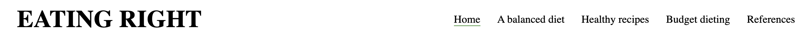

# EATING RIGHT 

## <b>OVERVIEW</b>

Eating Right is a website which has the purpose of promoting and encouraging people to eat healthier. In order to try and achieve this, I have included various features in the website such as a section which educates the user on a balanced diet, a video on how to diet on a budget in addition to a variety of healthy recipes which users can choose from. The target audience of Eating Right is the health conscious in addition to those who are trying or wanting to be.

-----------------------------------------------------------------------------------------------

## <b>FEATURES</b>

-----------------------------------------------------------------------------------------------

### EXISTING FEATURES 

#### - Navigation bar:

- The navigation bar is present on every page of the website amd is fully responsive
- It includes the logo, home page, a balanced diet page, Healthy recipes page, budget dieting page and references page.
- The purpose of the navigation bar is to try and allow the user to navigate across
the website's various pages with ease which is the value it will provide to the user

#### - Hero page image:

- The hero page includes a photo of a variety of healthy foods which is consistent with the nature of the website
- This value to the user is that it nay help make the website visually attractive and may also help grab their attention

#### - About section:

- The about section of the webpage informs users of the purpose of Eating Right
- The value of this to the user is that it may help them decide whether the website may be useful for themself or not.

#### - Footer:

- The footer includes links to Eating Right's social media pages which open up in a new tab when clicked
- The value of the footer to the user is that it may encourage them to stay connected to Eating Right via social media

#### - Balanced diet page image:

- The balanced diet page includes a picture of an image representing balance which is consistent with the theme of the page which is a balanced diet
- The value to the user is that it may make the webpage visually appealing for them and it may also help to grab their attention

#### - Balanced diet information section: 

- This section provides the user with information on a balanced diet
- The value to the user is that it may help them to better understand what a balanced diet is and consequently may help them to maintain a more balanced diet in their life

 #### - Recipe finder page:

- This page includes a list of healthy recipes which the user may choose from
- Each recipe is represented by an image of the dish along with text below which is the name of the dish
- Both the image and the text is a link which when clicked leads to an internal webpage that includes the full recipe details
- The value of this page to the user is that it will present a list of healthy recipes in a visually appealing way which may encourage them towards clicking on the recipes and finding out how to make them and so therefore this section may encourage them towards a healthier lifestyle

#### - Individual recipe pages:

- Each individual recipe page includes full details on the relevant recipe
- The structure on every seperate recipe page is similar with seperate sections for the ingredients and method
- The value that this page will provide to the user is that it may encourage them towards a healthier lifestyle by informing them of how to make healthy dishes which they or their families may eat

#### - Return button:

- The return button is featured on every individual recipe page and essentially is a hyperlink which redirects the user back to the main recipe overview page 
- The value that it may provide to the user is that it will allow them to navigate back to the main recipe page without having to go back to the main navigation menu and so may help to make navigation easier for them

#### - Budget dieting video:

- This video provides the user with tips on how to diet on a budget
- The value of this video is that it may help even those with not a lot of money to find find ways to eat healthy

#### - Reference page section:

- The references section includes links to sources of the content used to make the website that open up in a seperate page when clicked
- The value this may provide to the user is that if they want to find out who more information on healthy eating then they can do so by visiting the source websites

## <b>TESTING</b>

-------------------------------------------------------------------------------------------------------- 

I am able to confirm that the website works on different browsers: Safari, Chrome and Firefox.

I able to confirm that the website's images are diplayed nicely, the video works and how links for the website work as intended.

I am also able to confirm that the website is responsive and works on different screen sizes.

Upon testing, all sections consisting of text like logo, nav bar etc. are readable

I have tested all funtions and features of the website which work and meet purpose.

### Bugs

#### Solved bugs

One of the bugs I have encountered along the way include one to to do with the social media icons for the footer, where the actual icons would not display. I managed to solve this after realising that I had to sign up for Font Awesome first.

Another bug I encountered was to do with the Budget dieting tips video, where I tried to adjust the video size. Initially, I made a class which I assigned to the video in Html and tried styling in CSS but this didn't lead to the intended outcome. I then tried styling the video tag directly in HTML which worked.

Also, when using the navbar on one occasion I realised that when on an individual recipe page, the navbar was showing that I was on the references page when it was meant to show that I was on the healthy recipes page. I realised sooner or later that it was to do with the active class which was the case. Once the active class was assigned to the corrrect hyperlink, this bug was also fixed.

#### Unsolved bugs

No unsolved bugs

### Validator testing

#### - HTML

- No errors were returned when passing through the [official W3C validator](https://validator.w3.org/)

#### - CSS

- No errors were found when passing through the [official (Jigsaw) validator](https://jigsaw.w3.org/css-validator/Email.html)

#### - Accessability

I am able to confirm that my website is accessible to a sufficient standard according to Wave web accessability evaluation tool.

## <b>DEPLOYMENT</b>

-------------------------------------------------------------------------------------------------------- 

This site was deployed to GitHub pages. The steps for deployment include:

- Navigating to the settings tab in the GitHub repository 
- Selecting the master branch from the source section drop down menu
- Upon selecting the master branch, the page should provide the link to the completed website

## <b>CREDITS</b>

-------------------------------------------------------------------------------------------------------- 

### Content

The text for the balanced diet section was taken from [The British Nutrition Foundation](https://www.nutrition.org.uk/healthy-sustainable-diets/healthy-and-sustainable-diets/a-healthy-balanced-diet/).

The recipe content for every individual recipe page was taken from [BBC good food](https://www.bbcgoodfood.com/recipes/collection/healthy-dinner-recipes).

The icons in the footer were taken from [Font Awesome](https://fontawesome.com/).

### Media

The hero page image is from [Parade](https://parade.com/1010772/marysauer/cheap-healthy-food/).

The balanced diet page image is from [Forbes](https://www.forbes.com/sites/forbeshumanresourcescouncil/2020/09/30/work-life-balance-is-no-longer-just-a-company-issue/).

All images on the main recipe finder page and all individual recipe pages are from [BBC good food](https://link-url-here.org).

The video on the budget dieting page belongs to [Magnus Method Youtube channel ](https://link-url-here.org).

 ### Code

 A majority of help was taken from [W3schools](https://www.w3schools.com/) where a huge chunk of code used for the website is from. Other help/code was recieved from [HTML dog](https://htmldog.com/guides/css/beginner/borders/), [Stack overflow](https://stackoverflow.com/) and [Anvil project](https://anvilproject.org/guides/content/creating-links).